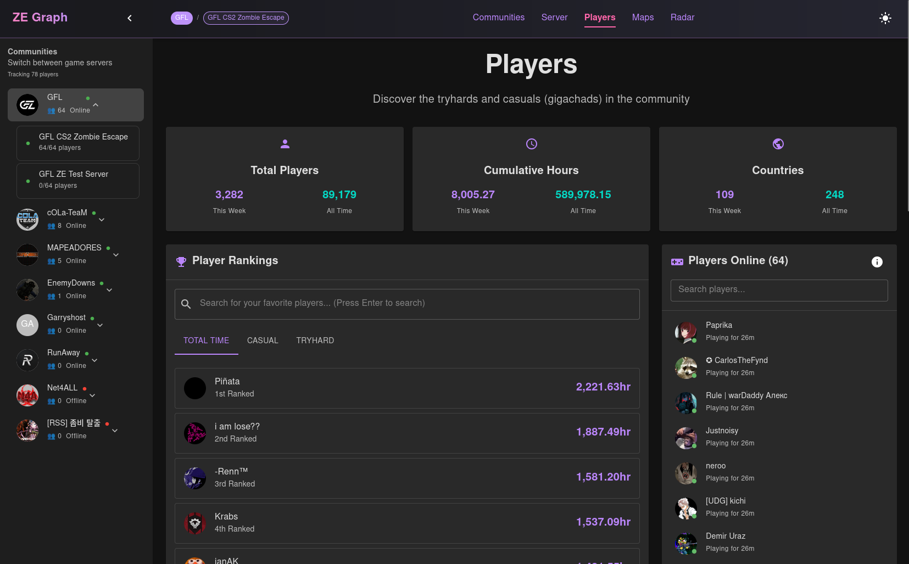
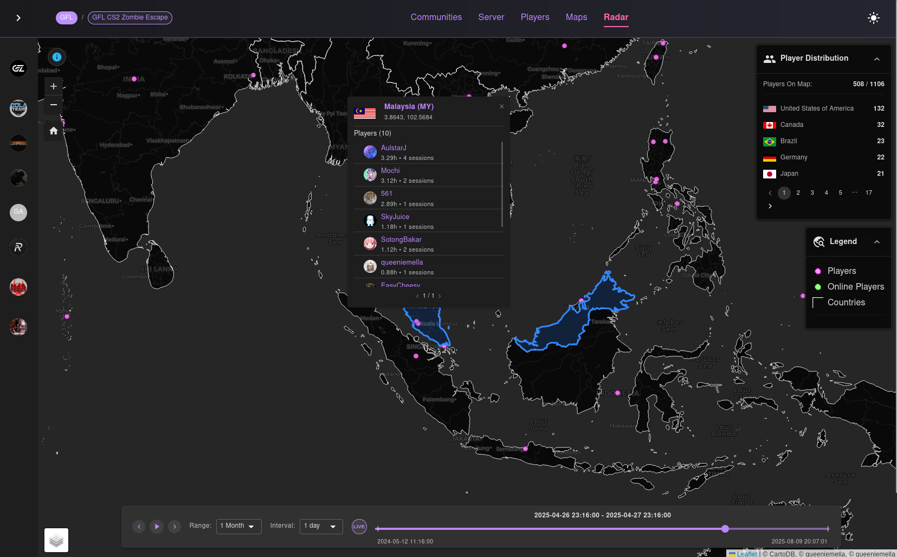

# gfl-ze-watcher

Show GFL ZE data for my own needs.
[Website](https://gflgraph.prettymella.site/) is hosted on a smol vps, be nice :)

This is codebase is purely for displaying data from the database. Itself does
not store the player data and webscraping. Those are hidden.

## How it works

```mermaid
flowchart LR
  %% Frontend
  subgraph FE["🌐 Frontend"]
    direction TB
    Website("The Website")
  end
  %% Backend & GIS
  subgraph BE["🖥️ Backend Services"]
    direction TB
    Backend("Backend")
    QGIS("QGIS Server")
    ProfileProvider("Profile Picture Provider")
  end
  %% Scraper & Database
  subgraph DSDB["🗄️ Scraper & Database"]
    direction TB
    DataScraper("Data Scraper (Hidden)")
    Database[("PostgreSQL")]
  end
  %% External services
  subgraph EX["🔗 External Services"]
    direction TB
    ExternalProfileProvider("External Profile Provider")
    SteamAPI("Steam API")
    SteamProtocol("Steam Protocols")
    GFLBans("GFLBans")
    Vauff("Vauff.com")
  end
  %% Connections with higher contrast arrows
  Website        ==> Backend
  QGIS           == WMS ==> Website
  Database       == PostGIS ==> QGIS
  Backend        ==>|Write Only| Database
  Database       ==>|Heavy Query| Backend
  Backend        ==> Website
  DataScraper    ==> Database
  Database       ==> DataScraper
  ProfileProvider ==>|Image URL| Backend
  SteamAPI       ==> ProfileProvider
  ExternalProfileProvider ==> ProfileProvider
  SteamAPI       ==>|Location| DataScraper
  SteamProtocol  ==> DataScraper
  GFLBans        ==>|Infraction| DataScraper
  Vauff          ==>|Map Images| Backend
  %% GitHub-friendly styles with high contrast and rounded borders
  classDef fe fill:#e1f5fe,stroke:#0277bd,stroke-width:2px,color:#000000
  classDef be fill:#e8f5e9,stroke:#2e7d32,stroke-width:2px,color:#000000
  classDef db fill:#f3e5f5,stroke:#7b1fa2,stroke-width:2px,color:#000000
  classDef ex fill:#fff3e0,stroke:#ef6c00,stroke-width:2px,color:#000000
  %% Apply styling to nodes
  class Website fe
  class Backend,QGIS,ProfileProvider be
  class DataScraper,Database db
  class ExternalProfileProvider,SteamAPI,SteamProtocol,GFLBans,Vauff ex
  %% Style subgraphs with rounded corners
  style FE fill:#e1f5fe,stroke:#0277bd,stroke-width:2px,color:#000000
  style BE fill:#e8f5e9,stroke:#2e7d32,stroke-width:2px,color:#000000
  style DSDB fill:#f3e5f5,stroke:#7b1fa2,stroke-width:2px,color:#000000
  style EX fill:#fff3e0,stroke:#ef6c00,stroke-width:2px,color:#000000
```

## Preview

